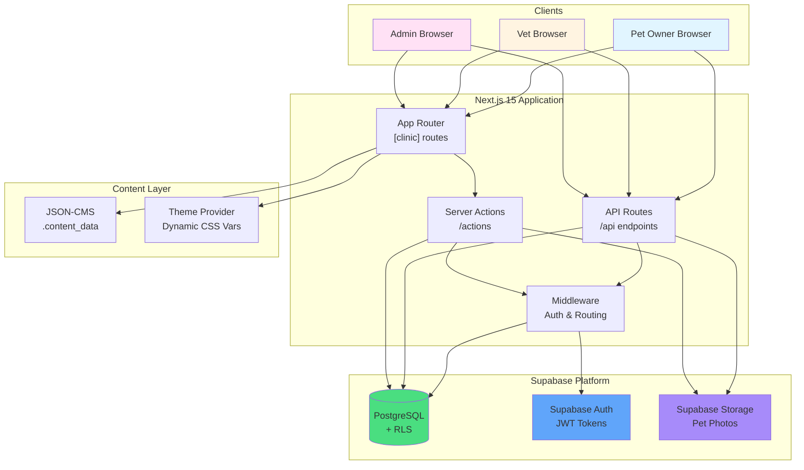

# System Architecture Diagram

High-level overview of the Vete platform architecture.

## Components

- **Clients**: Three user types accessing the platform
- **Next.js Application**: App Router, API routes, Server Actions, Middleware
- **Content Layer**: JSON-CMS for clinic content, dynamic theming
- **Supabase Platform**: Database with RLS, authentication, file storage

