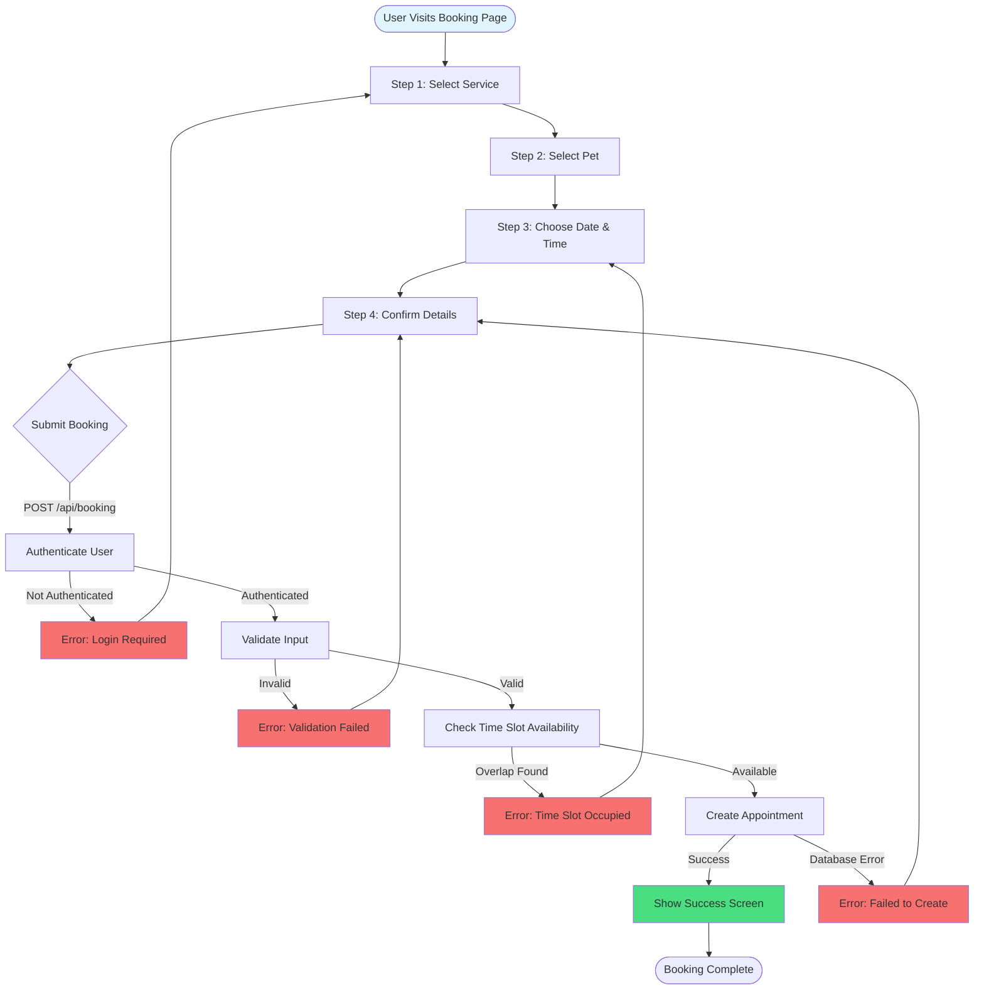

# Appointment Booking Flow

Complete flow from service selection to appointment confirmation.

## Steps Detail

1. **Service Selection**: User picks from available services
2. **Pet Selection**: Choose pet (or register new one)
3. **Date/Time**: Calendar picker + time slot selection
4. **Confirmation**: Review details before submission
5. **Validation**: Auth check, input validation, overlap detection
6. **Creation**: Insert into `appointments` table
7. **Success**: Confirmation screen with appointment details

