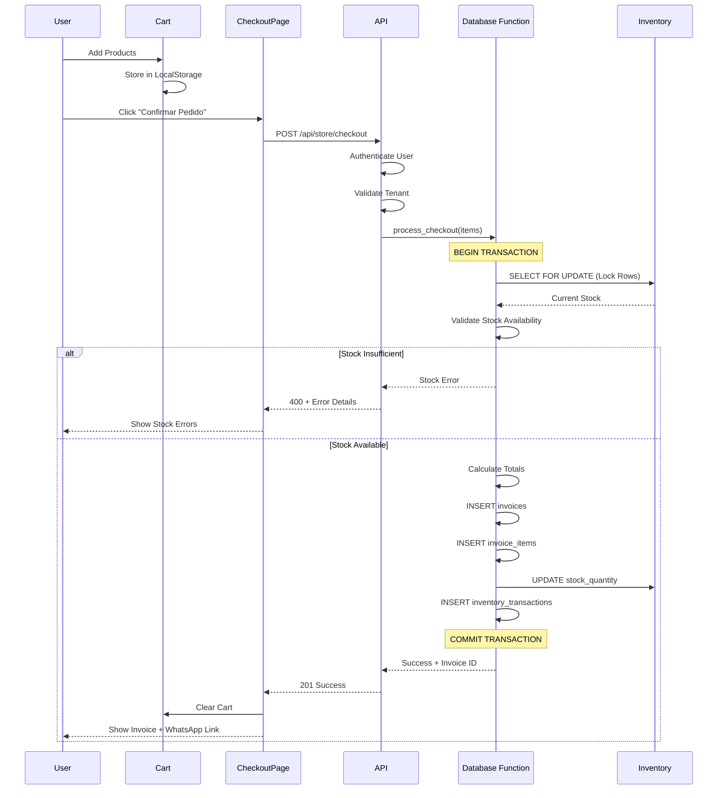

# Store Checkout Flow

E-commerce checkout process with stock validation and transaction safety.

## Key Features

- **Stock Locking**: `SELECT FOR UPDATE` prevents race conditions
- **Atomic Transaction**: All operations in single transaction
- **Error Handling**: Clear error messages for stock issues
- **Audit Trail**: All inventory changes logged

