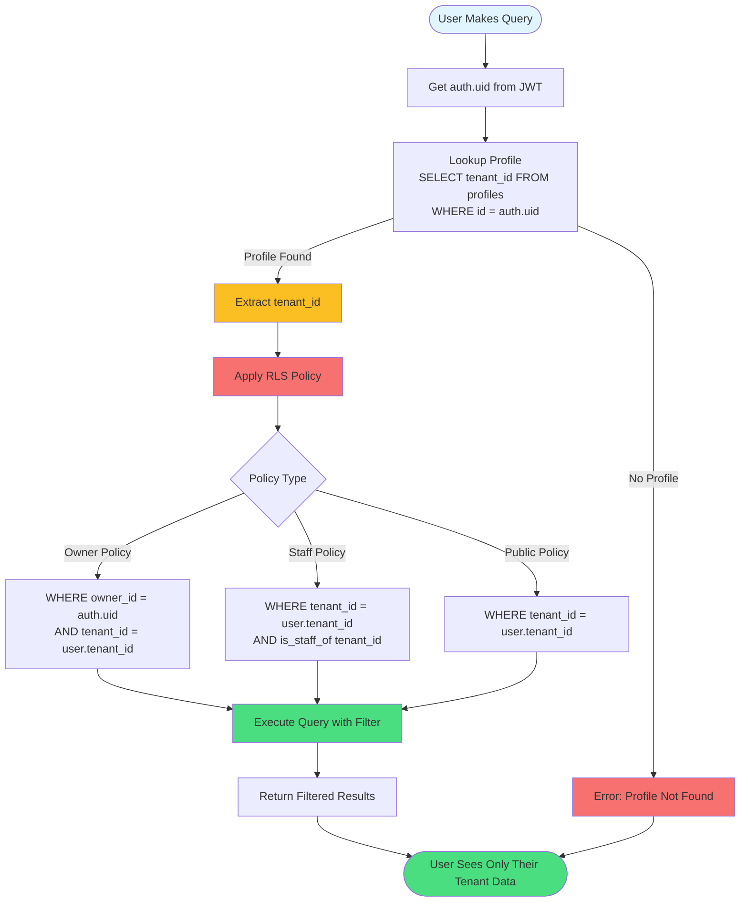

# Row-Level Security (RLS) Isolation Flow

How RLS ensures multi-tenant data isolation.



## RLS Policy Examples

### Owner Policy (Pets)
```sql
CREATE POLICY "Owners see own pets"
ON pets FOR SELECT
USING (
    owner_id = auth.uid()
    AND tenant_id = (SELECT tenant_id FROM profiles WHERE id = auth.uid())
);
```

### Staff Policy (All Pets)
```sql
CREATE POLICY "Staff see tenant pets"
ON pets FOR SELECT
USING (is_staff_of(tenant_id));
```

## Protection Layers

1. **JWT Validation**: Supabase validates token
2. **Profile Lookup**: Get user's tenant_id
3. **RLS Policy**: Automatic WHERE clause injection
4. **Query Execution**: Database enforces isolation
5. **Result Filtering**: Only tenant data returned

