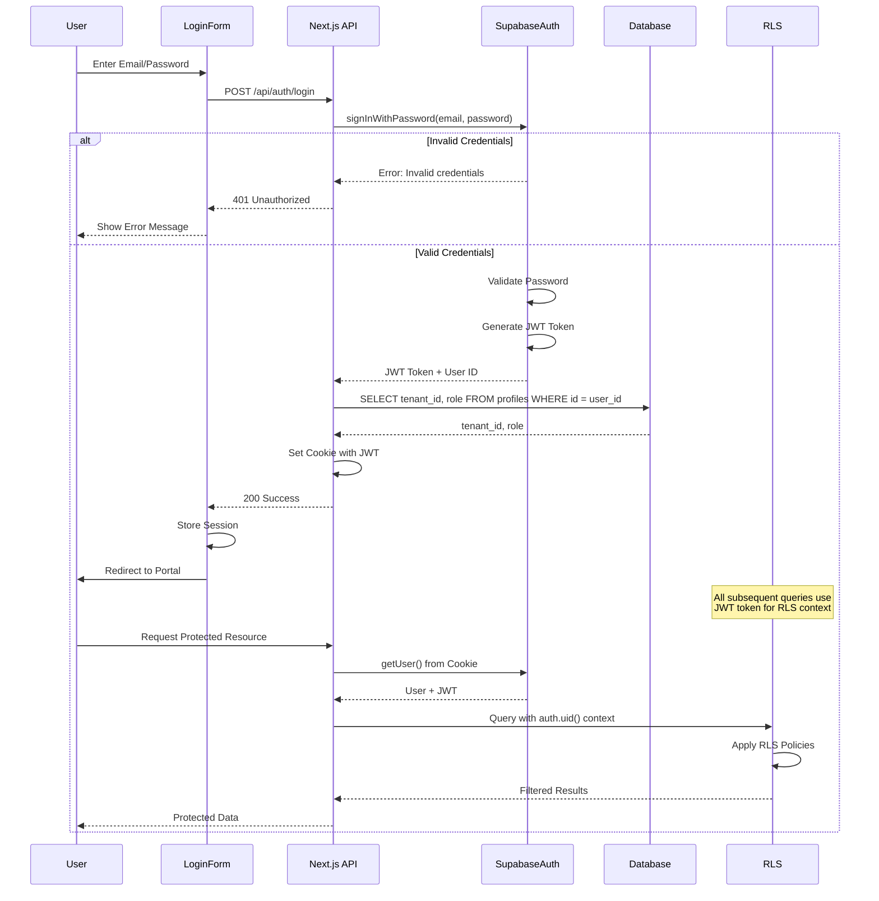

# Authentication Flow

Complete authentication process from login to session establishment.

## Session Management

- **JWT Token**: Stored in HTTP-only cookie
- **Session Duration**: Configurable in Supabase
- **Auto-Refresh**: Token refreshed automatically
- **RLS Context**: `auth.uid()` available in all queries

