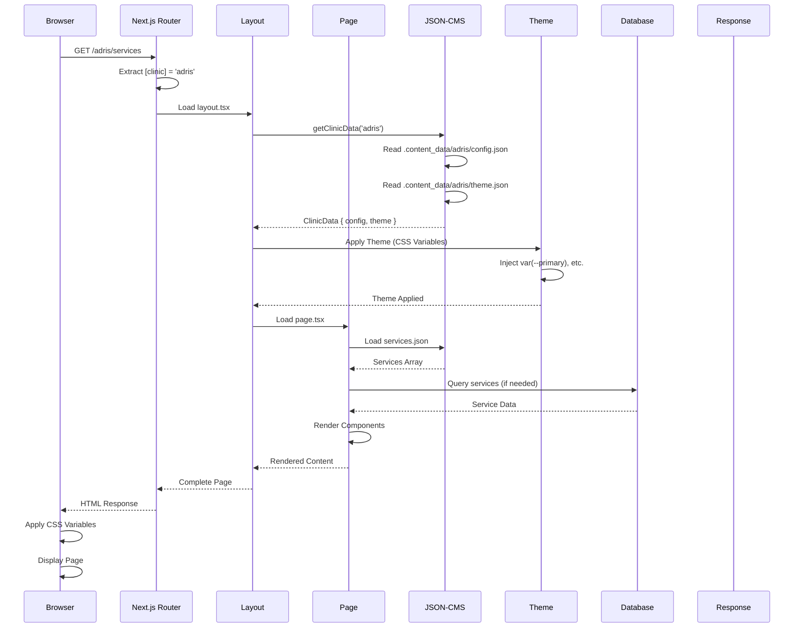

# Page Load Flow

How a page request flows through the Next.js application.

## Key Steps

1. **Route Matching**: Next.js matches `/[clinic]/services`
2. **Layout Loading**: Clinic layout loads config and theme
3. **Content Loading**: Page-specific JSON content loaded
4. **Database Query**: Dynamic data fetched (if needed)
5. **Rendering**: React components render with theme
6. **Response**: HTML sent to browser with CSS variables

## Performance Optimizations

- **Static Generation**: Clinic pages pre-rendered at build time
- **Caching**: JSON files cached in memory
- **CDN**: Static assets served from CDN
- **Database**: RLS adds minimal query overhead

