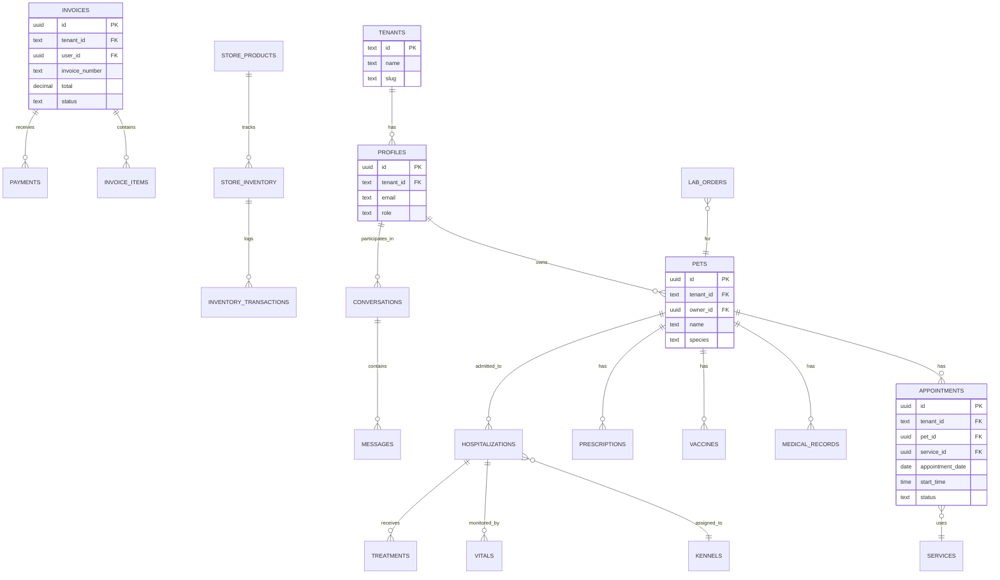

# Core Entity Relationship Diagram

Main database entities and their relationships.

## Key Relationships

- **Tenants → Profiles**: One tenant has many users
- **Profiles → Pets**: One owner has many pets
- **Pets → Appointments**: One pet has many appointments
- **Pets → Medical Records**: One pet has many medical records
- **Invoices → Invoice Items**: One invoice has many line items
- **Store Products → Inventory**: One product has inventory tracking

## Multi-Tenancy

All tables include `tenant_id` for isolation:
- `pets.tenant_id` → `tenants.id`
- `appointments.tenant_id` → `tenants.id`
- `invoices.tenant_id` → `tenants.id`

