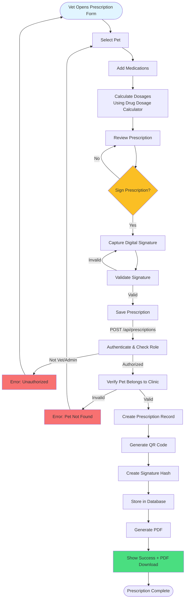

# Prescription Workflow

Complete flow from prescription creation to PDF generation and signing.

## Key Steps

1. **Pet Selection**: Choose patient from clinic pets
2. **Add Medications**: Enter drugs with dosage, frequency, route
3. **Dosage Calculation**: System calculates based on weight/species
4. **Digital Signature**: Vet signs prescription digitally
5. **Validation**: Verify signature and pet ownership
6. **Storage**: Save with QR code and signature hash
7. **PDF Generation**: Create printable prescription document

