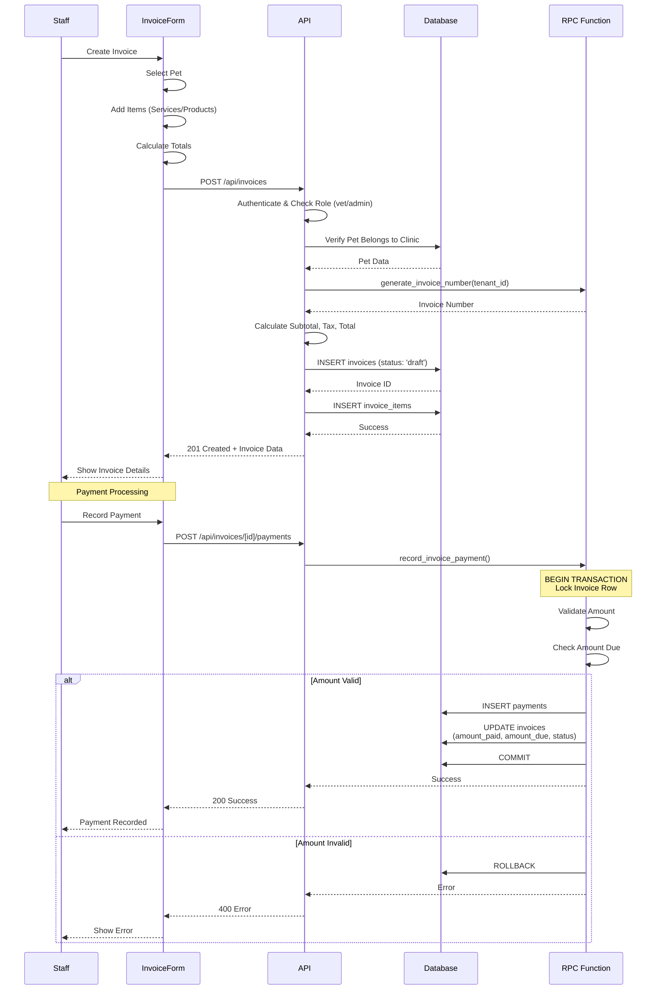

# Invoice Creation & Payment Flow

Complete invoicing workflow from creation to payment processing.

## Invoice States

- **draft**: Initial creation, can be edited
- **sent**: Sent to client, awaiting payment
- **partial**: Partially paid
- **paid**: Fully paid
- **overdue**: Past due date, unpaid
- **cancelled**: Cancelled invoice

## Payment Processing

- **Atomic Operation**: Uses RPC function with transaction
- **Row Locking**: Prevents concurrent payment issues
- **Status Updates**: Automatically updates invoice status
- **Audit Trail**: All payments logged

