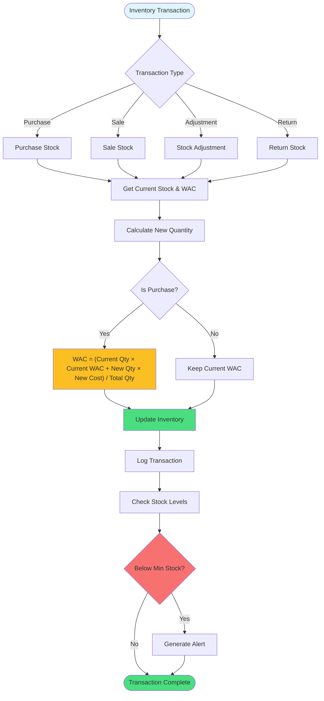

# Inventory Management with WAC

Stock management using Weighted Average Cost (WAC) method.



## WAC Calculation Example

```
Initial State:
- Stock: 100 units
- WAC: $10.00 per unit

Purchase:
- New Stock: 50 units at $12.00 per unit

Calculation:
WAC = (100 × $10.00 + 50 × $12.00) / 150
WAC = ($1,000 + $600) / 150
WAC = $1,600 / 150
WAC = $10.67 per unit

Result:
- Stock: 150 units
- WAC: $10.67 per unit
```

## Transaction Types

- **purchase**: Stock in, updates WAC
- **sale**: Stock out, keeps WAC
- **adjustment**: Manual correction
- **return**: Stock back in, keeps WAC

