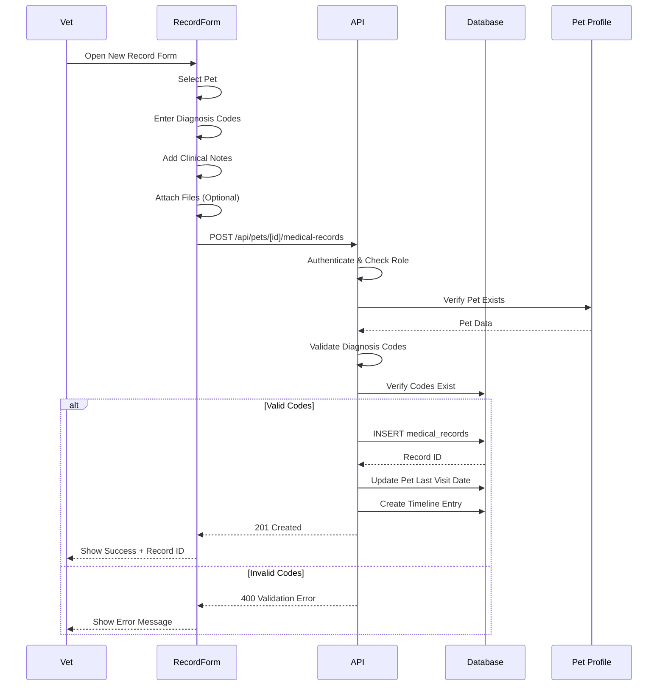

# Medical Record Creation Flow

Flow for creating medical records during consultations.

## Record Components

- **Diagnosis**: VeNom/SNOMED codes
- **Clinical Notes**: Free-text observations
- **Examination**: Physical exam findings
- **Treatment**: Procedures performed
- **Attachments**: Images, documents
- **Timeline**: Automatic entry in pet history

