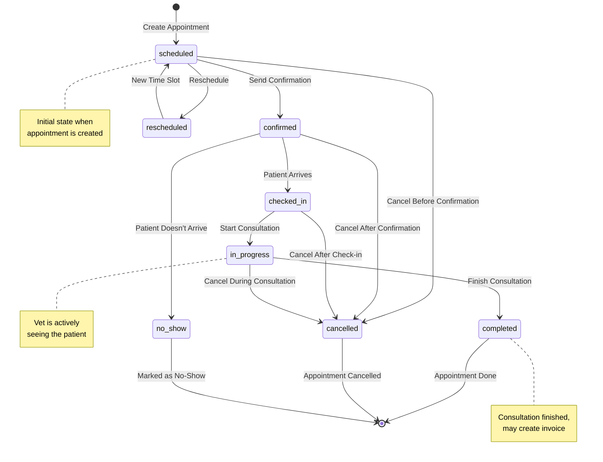

# Appointment State Machine

Complete lifecycle of appointment states and transitions.

## State Descriptions

- **scheduled**: Appointment created, awaiting confirmation
- **confirmed**: Client confirmed attendance
- **checked_in**: Patient arrived at clinic
- **in_progress**: Consultation actively happening
- **completed**: Consultation finished successfully
- **cancelled**: Appointment cancelled (any stage)
- **no_show**: Patient didn't arrive
- **rescheduled**: Moved to different time

## Business Rules

- Cannot cancel completed appointments
- No-show can only occur from confirmed state
- Rescheduling creates new scheduled appointment
- Completed appointments may trigger invoice creation

