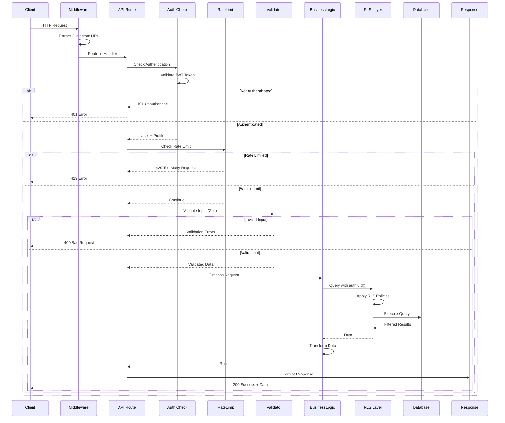

# API Request Lifecycle

Complete flow of an API request from client to database and back.

## Layers

1. **Middleware**: URL parsing, routing
2. **Authentication**: JWT validation
3. **Rate Limiting**: Prevent abuse
4. **Validation**: Input sanitization
5. **Business Logic**: Core functionality
6. **RLS**: Automatic tenant filtering
7. **Database**: Data storage
8. **Response**: Format and return

