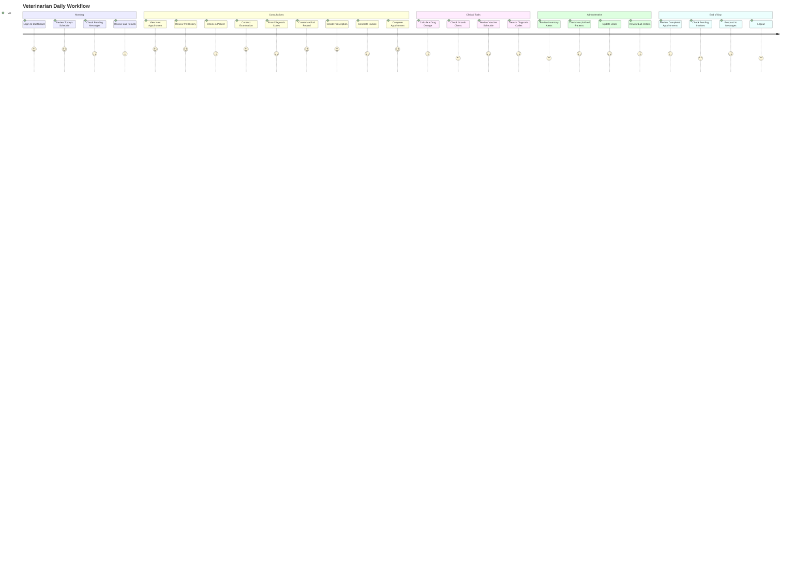

# Veterinarian User Journey

Daily workflow for veterinary staff.

## Daily Activities

- **Consultations**: Primary work activity
- **Clinical Tools**: Decision support during exams
- **Administrative**: Patient management tasks
- **Communication**: Client messaging

