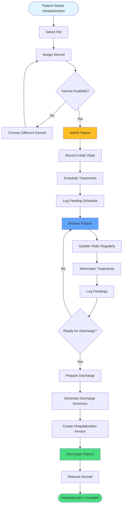

# Hospitalization Admission Flow

Complete process from admission to discharge.

## Hospitalization Components

- **Kennel Assignment**: Track cage/kennel availability
- **Vitals Monitoring**: Regular temperature, HR, RR, pain scale
- **Treatment Schedule**: Medications and procedures
- **Feeding Logs**: Food type, amount, frequency
- **Discharge Summary**: Complete record of stay

