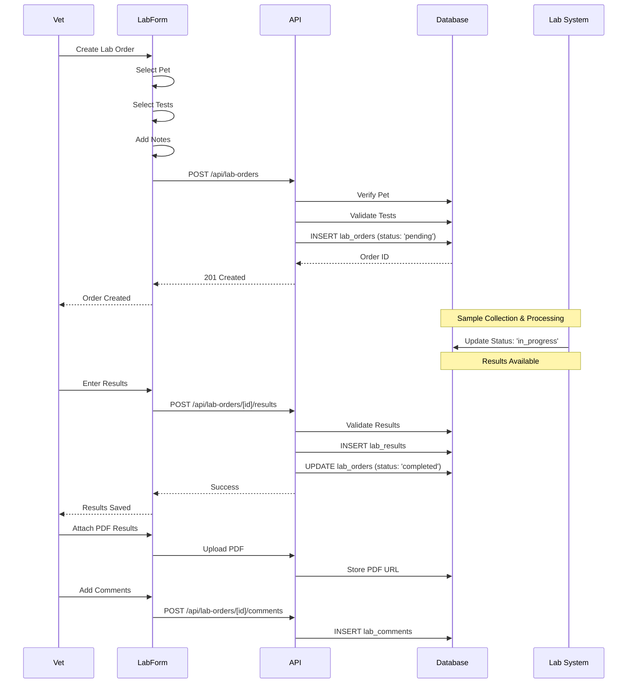

# Lab Order Workflow

From order creation to result entry and review.

## Lab Order States

- **pending**: Order created, awaiting sample
- **in_progress**: Sample collected, processing
- **completed**: Results entered
- **cancelled**: Order cancelled

## Result Entry

- **Manual Entry**: Vet enters values directly
- **PDF Upload**: Attach lab report PDF
- **Abnormal Flagging**: System flags out-of-range values
- **Comments**: Internal notes and discussion

