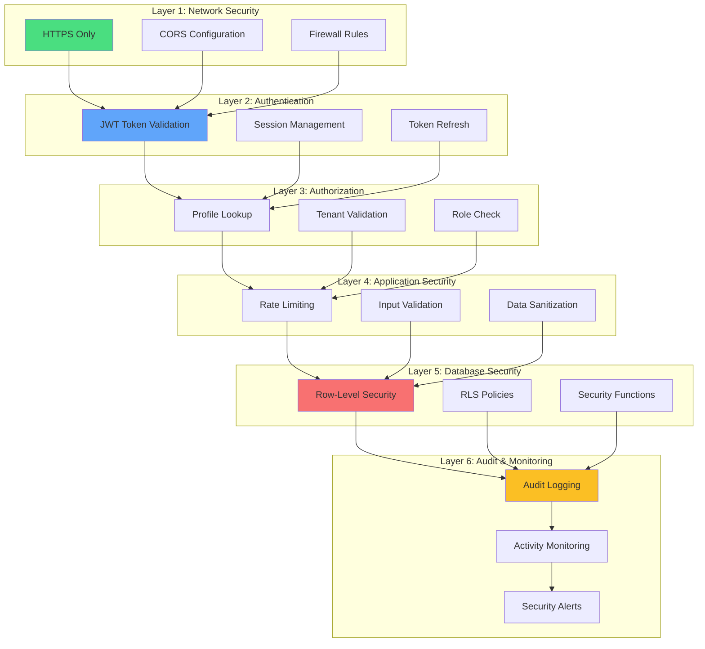

# Security Architecture Layers

Multiple layers of security protecting the platform.

## Security Principles

1. **Defense in Depth**: Multiple layers of protection
2. **Least Privilege**: Users only access what they need
3. **Tenant Isolation**: RLS ensures data separation
4. **Audit Trail**: All actions logged
5. **Input Validation**: All inputs validated and sanitized

