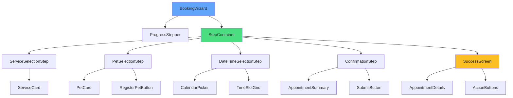

# Booking Wizard Component Hierarchy

React component structure for the appointment booking flow.

## Component Responsibilities

- **BookingWizard**: Main orchestrator, manages state
- **ProgressStepper**: Visual progress indicator
- **StepContainer**: Renders current step
- **ServiceSelectionStep**: Service selection UI
- **PetSelectionStep**: Pet selection UI
- **DateTimeSelectionStep**: Date/time picker
- **ConfirmationStep**: Review before submission
- **SuccessScreen**: Confirmation after booking

