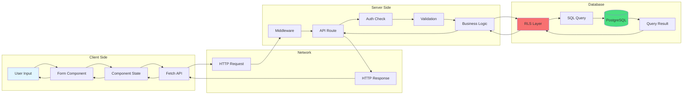

# End-to-End Data Flow

Complete data journey from user input to database and back.

## Data Transformation Points

1. **Form Input**: User types → Component state
2. **API Request**: State → JSON → HTTP
3. **Validation**: JSON → Validated objects
4. **RLS Filtering**: Query → Tenant-filtered query
5. **Database**: Query → Results
6. **Response**: Results → JSON → HTTP
7. **Component Update**: Response → State → UI

