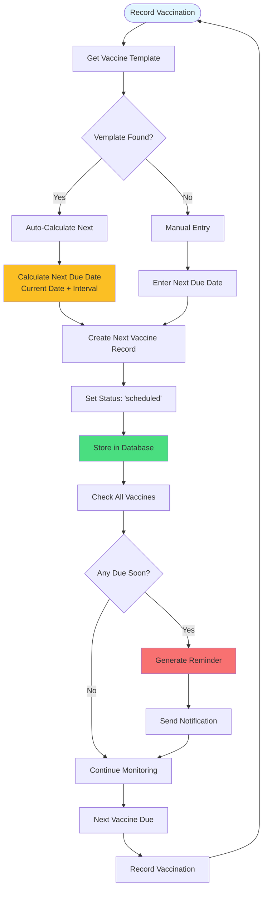

# Vaccine Schedule Tracking

How vaccine schedules are managed and due dates calculated.



## Vaccine Template Structure

```json
{
  "vaccine_type": "DHPP",
  "initial_age_weeks": 6,
  "interval_weeks": 3,
  "total_doses": 3,
  "booster_interval_months": 12
}
```

## Schedule Calculation

- **First Dose**: Based on pet age
- **Subsequent Doses**: Previous dose date + interval
- **Boosters**: Annual or as specified
- **Due Alerts**: Generated 1 week before due date

