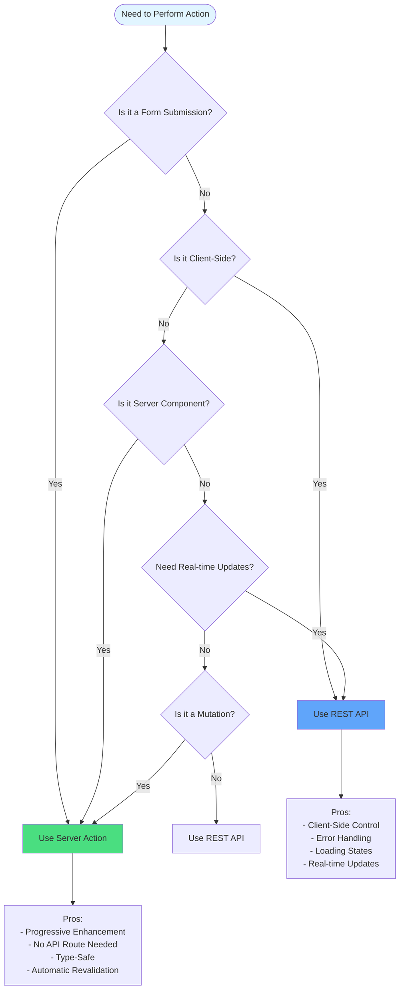

# Server Action vs REST API Decision Tree

When to use Server Actions vs REST API endpoints.

## Use Cases

### Server Actions
- Form submissions
- Mutations from Server Components
- Actions that need automatic revalidation
- Progressive enhancement scenarios

### REST API
- Client-side data fetching
- Real-time updates
- Complex error handling
- External API integrations

