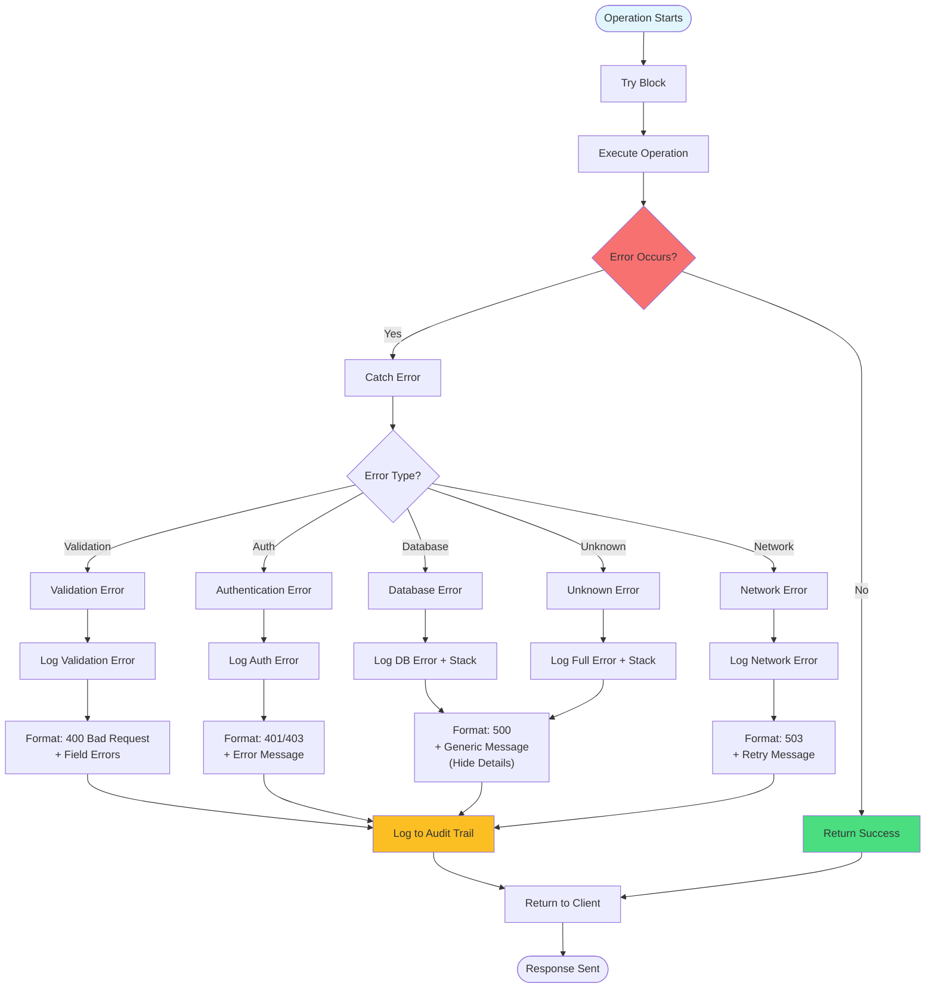

# Error Handling Flow

How errors are caught, logged, and returned to clients.



## Error Categories

- **Validation (400)**: Invalid input, missing fields
- **Authentication (401)**: Not logged in
- **Authorization (403)**: Wrong role/tenant
- **Not Found (404)**: Resource doesn't exist
- **Database (500)**: Query/transaction failed
- **Network (503)**: External service unavailable

## Error Response Format

```json
{
  "error": "User-friendly message",
  "code": "ERROR_CODE",
  "details": {},
  "fieldErrors": {}
}
```

