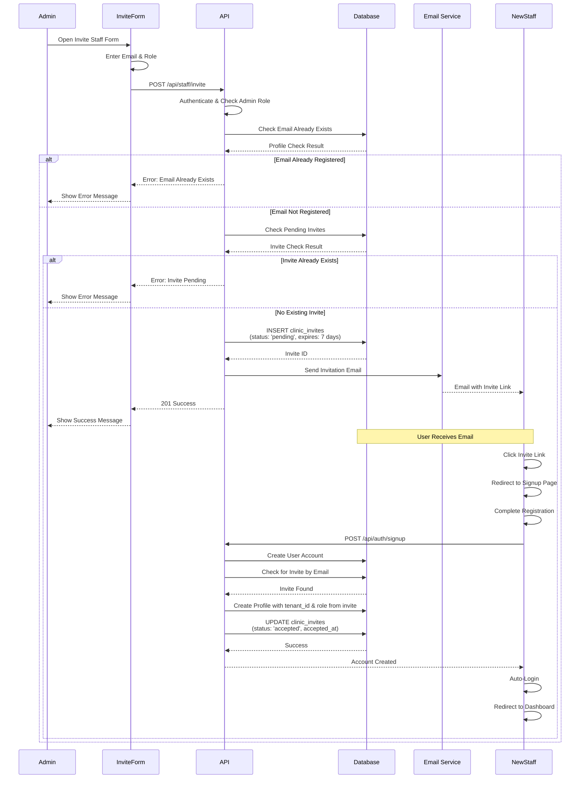

# Staff Invitation Flow

Complete process for inviting and onboarding new staff members.

## Invite States

- **pending**: Invite sent, awaiting acceptance
- **accepted**: User signed up and accepted invite
- **expired**: Invite expired (7 days)
- **cancelled**: Admin cancelled invite

## Security

- Only admins can invite staff
- Invites expire after 7 days
- Email must be unique per tenant
- Role assigned from invite (vet/admin)

