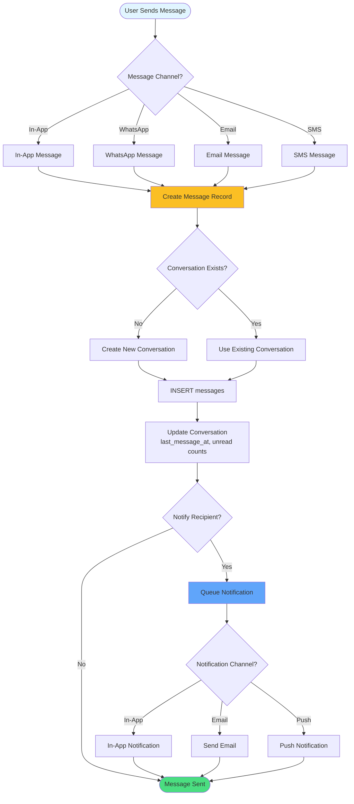

# Messaging & Communication Flow

How messages flow between clients and staff through multiple channels.

## Message Types

- **text**: Plain text message
- **image**: Image attachment
- **file**: Document attachment
- **appointment_card**: Appointment details card
- **invoice_card**: Invoice details card
- **prescription_card**: Prescription details card

## Conversation States

- **open**: Active conversation
- **pending**: Awaiting response
- **resolved**: Issue resolved
- **closed**: Conversation closed
- **spam**: Marked as spam

