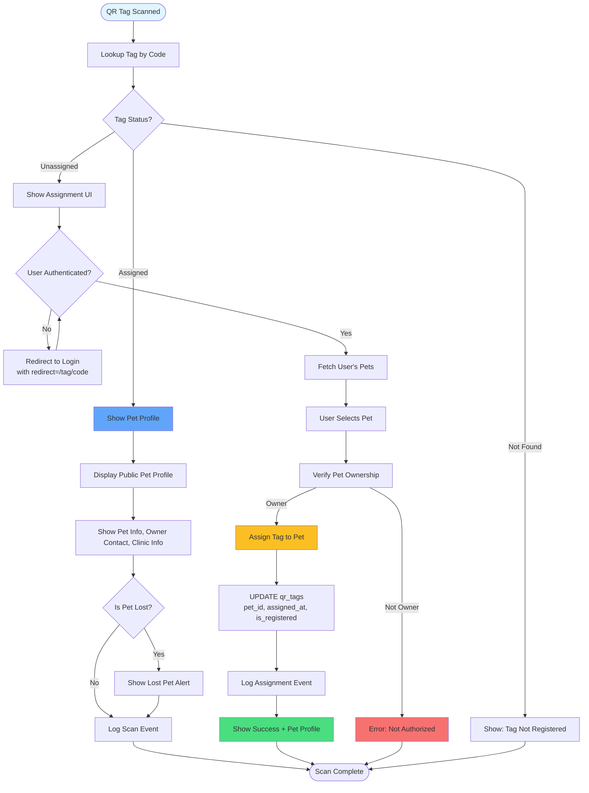

# QR Tag Assignment Flow

How QR tags are assigned to pets and scanned for identification.

## Tag States

- **unassigned**: Tag exists but not linked to pet
- **assigned**: Tag linked to pet, active
- **inactive**: Tag deactivated
- **reassigned**: Tag moved to different pet

## Public Profile Information

- Pet name, species, breed
- Pet photo
- Owner contact (if authorized)
- Clinic contact information
- Lost pet status (if applicable)

