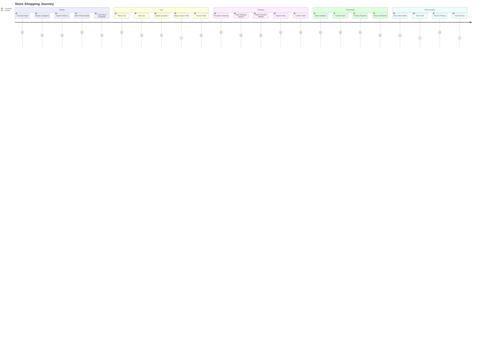

# Store Shopping Flow

Complete e-commerce shopping experience from browsing to purchase.

## Shopping Features

- **Product Catalog**: Browse by category, search, filters
- **Product Details**: Images, descriptions, pricing, stock status
- **Shopping Cart**: Add/remove items, update quantities
- **Coupons**: Apply discount codes
- **Checkout**: Secure payment processing
- **Order Tracking**: View order status
- **Reviews**: Rate and review products

