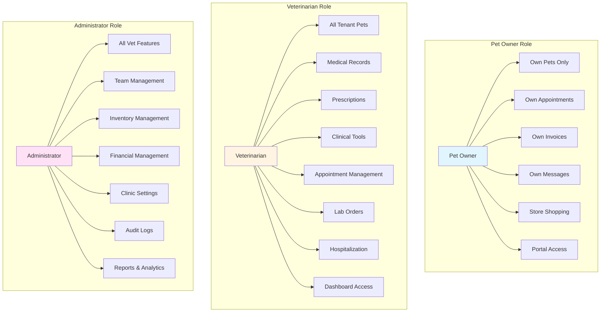

# Role-Based Access Control (RBAC)

How different user roles determine access permissions.

## Permission Matrix

| Feature | Owner | Vet | Admin |
|---------|-------|-----|-------|
| View Own Pets | ✅ | ✅ | ✅ |
| View All Pets | ❌ | ✅ | ✅ |
| Create Medical Records | ❌ | ✅ | ✅ |
| Create Prescriptions | ❌ | ✅ | ✅ |
| Manage Appointments | Own Only | All | All |
| Create Invoices | ❌ | ✅ | ✅ |
| Manage Inventory | ❌ | ❌ | ✅ |
| Invite Staff | ❌ | ❌ | ✅ |
| Clinic Settings | ❌ | ❌ | ✅ |
| View Audit Logs | ❌ | ❌ | ✅ |

## Access Control Implementation

- **Database Level**: RLS policies enforce tenant isolation
- **Application Level**: Role checks in API routes
- **UI Level**: Conditional rendering based on role
- **Function Level**: `is_staff_of()` helper function

