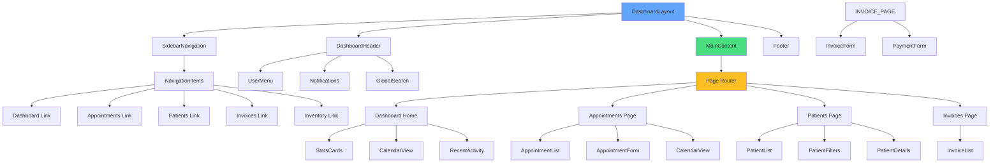

# Dashboard Component Hierarchy

React component structure for the staff dashboard.

## Dashboard Sections

- **Navigation**: Sidebar with main sections
- **Header**: User menu, notifications, search
- **Content**: Dynamic based on route
- **Footer**: Clinic information, links

