# Deployment & CI/CD Flow

How code changes flow from development to production.

```mermaid
flowchart LR
    DEV[Developer] --> COMMIT[Git Commit]
    COMMIT --> PUSH[Push to Branch]
    
    PUSH --> TRIGGER[CI/CD Triggered]
    
    TRIGGER --> BUILD[Build Application]
    BUILD --> TEST[Run Tests]
    
    TEST --> TEST_RESULT{Tests Pass?}
    TEST_RESULT -->|No| FAIL[Fail Build]
    TEST_RESULT -->|Yes| LINT[Run Linters]
    
    LINT --> LINT_RESULT{Lint Pass?}
    LINT_RESULT -->|No| FAIL
    LINT_RESULT -->|Yes| SECURITY[Security Scan]
    
    SECURITY --> SEC_RESULT{Security OK?}
    SEC_RESULT -->|No| FAIL
    SEC_RESULT -->|Yes| BUILD_IMAGE[Build Docker Image]
    
    BUILD_IMAGE --> DEPLOY_STAGING[Deploy to Staging]
    DEPLOY_STAGING --> E2E[Run E2E Tests]
    
    E2E --> E2E_RESULT{E2E Pass?}
    E2E_RESULT -->|No| ROLLBACK[Rollback]
    E2E_RESULT -->|Yes| APPROVE{Manual Approval?}
    
    APPROVE -->|No| WAIT[Wait for Approval]
    APPROVE -->|Yes| DEPLOY_PROD[Deploy to Production]
    
    DEPLOY_PROD --> HEALTH[Health Check]
    HEALTH --> MONITOR[Monitor Production]
    
    FAIL --> NOTIFY[Notify Developer]
    ROLLBACK --> NOTIFY
    
    style DEV fill:#e1f5ff
    style DEPLOY_PROD fill:#4ade80
    style FAIL fill:#f87171
    style MONITOR fill:#60a5fa
```

## CI/CD Stages

1. **Build**: Compile TypeScript, bundle assets
2. **Test**: Unit, integration, E2E tests
3. **Lint**: Code quality checks
4. **Security**: Vulnerability scanning
5. **Deploy Staging**: Deploy to staging environment
6. **E2E**: End-to-end testing in staging
7. **Deploy Production**: Deploy to production
8. **Monitor**: Health checks and monitoring

