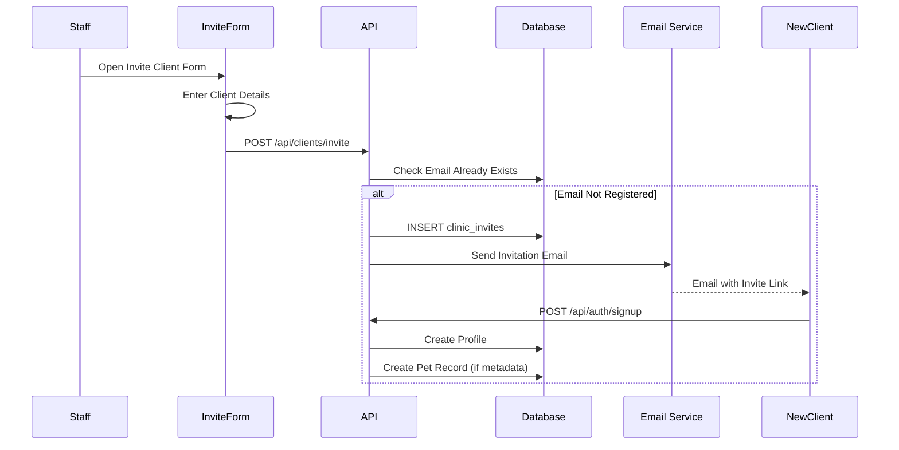

# Client Invitation Flow

Complete process for inviting and onboarding new pet owners.

```mermaid
sequenceDiagram
    participant Staff
    participant InviteForm
    participant API
    participant DB as Database
    participant Email as Email Service
    participant NewClient

    Staff->>InviteForm: Open Invite Client Form
    InviteForm->>InviteForm: Enter Client Details
    InviteForm->>API: POST /api/clients/invite
    API->>DB: Check Email Already Exists
    alt Email Not Registered
        API->>DB: INSERT clinic_invites
        API->>Email: Send Invitation Email
        Email-->>NewClient: Email with Invite Link
        NewClient->>API: POST /api/auth/signup
        API->>DB: Create Profile
        API->>DB: Create Pet Record (if metadata)
    end
```
