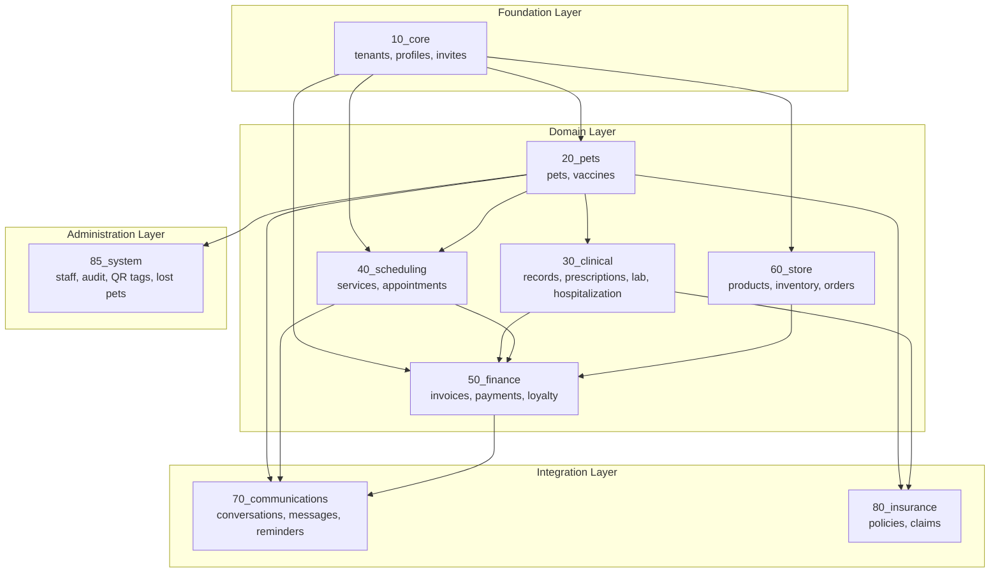
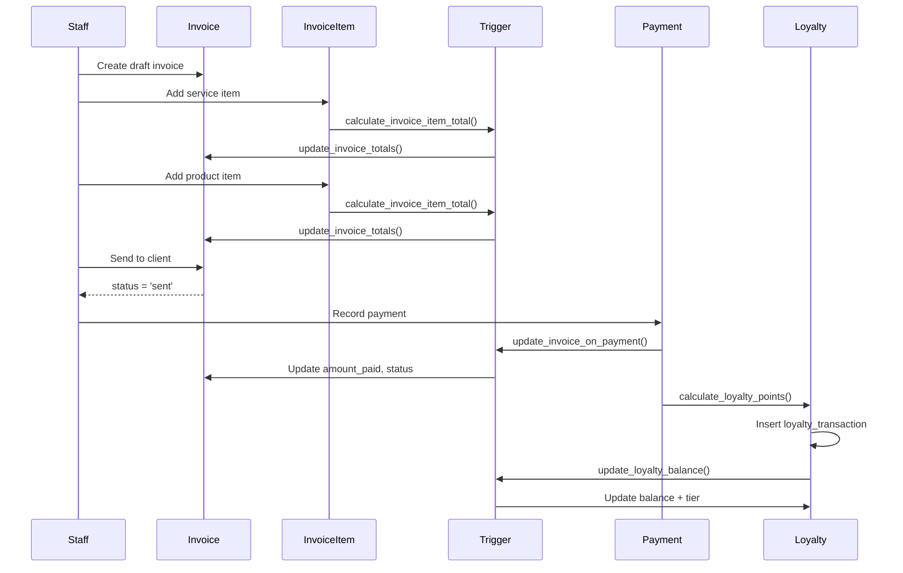

# Database Entity-Relationship Diagram

This document provides visual ER diagrams for the Vete multi-tenant veterinary platform database.

## Complete System Overview

```mermaid
erDiagram
    %% =====================================================
    %% CORE MULTI-TENANCY (10_core)
    %% =====================================================

    tenants ||--o{ profiles : "has members"
    tenants ||--o{ pets : "contains"
    tenants ||--o{ services : "offers"
    tenants ||--o{ appointments : "schedules"
    tenants ||--o{ invoices : "bills"
    tenants ||--o{ store_products : "sells"

    tenants {
        TEXT id PK
        TEXT name
        TEXT slug
        TEXT phone
        TEXT email
        JSONB settings
        TEXT[] features_enabled
        BOOLEAN is_active
    }

    profiles {
        UUID id PK
        TEXT tenant_id FK
        TEXT full_name
        TEXT email
        TEXT phone
        TEXT role "owner|vet|admin"
        TEXT avatar_url
        TIMESTAMPTZ deleted_at
    }

    clinic_invites {
        UUID id PK
        TEXT tenant_id FK
        TEXT email
        TEXT role
        TEXT status "pending|accepted|expired"
        UUID invited_by FK
        TIMESTAMPTZ expires_at
    }

    document_sequences {
        UUID id PK
        TEXT tenant_id FK
        TEXT document_type
        INTEGER year
        INTEGER current_sequence
        TEXT prefix
    }

    %% =====================================================
    %% PET MANAGEMENT (20_pets)
    %% =====================================================

    profiles ||--o{ pets : "owns"
    pets ||--o{ vaccines : "receives"
    pets ||--o{ vaccine_reactions : "has"
    pets ||--o{ medical_records : "has"
    pets ||--o{ appointments : "attends"
    pets ||--o{ hospitalizations : "admitted to"
    pets ||--o{ qr_tags : "tagged with"

    pets {
        UUID id PK
        TEXT tenant_id FK
        UUID owner_id FK
        TEXT name
        TEXT species "dog|cat|bird|rabbit|other"
        TEXT breed
        DATE birth_date
        TEXT gender "male|female|unknown"
        NUMERIC weight_kg
        TEXT microchip_number
        TEXT photo_url
        TEXT[] allergies
        TEXT[] chronic_conditions
        TIMESTAMPTZ deleted_at
    }

    vaccines {
        UUID id PK
        TEXT tenant_id FK
        UUID pet_id FK
        UUID template_id FK
        TEXT name
        DATE administered_date
        DATE next_due_date
        TEXT status "scheduled|completed|missed|cancelled"
        TEXT batch_number
        UUID administered_by FK
    }

    vaccine_reactions {
        UUID id PK
        TEXT tenant_id FK
        UUID pet_id FK
        UUID vaccine_id FK
        TEXT reaction_type
        TEXT severity "low|medium|high|critical"
        INTEGER onset_hours
        TEXT notes
    }

    vaccine_templates {
        UUID id PK
        TEXT tenant_id FK "nullable=global"
        TEXT name
        TEXT[] species
        INTEGER interval_months
        BOOLEAN is_required
        BOOLEAN is_active
    }

    %% =====================================================
    %% CLINICAL MODULE (30_clinical)
    %% =====================================================

    pets ||--o{ prescriptions : "prescribed"
    profiles ||--o{ prescriptions : "writes"
    pets ||--o{ lab_orders : "tested"
    lab_orders ||--o{ lab_order_items : "contains"
    lab_orders ||--o{ lab_results : "produces"

    medical_records {
        UUID id PK
        TEXT tenant_id FK
        UUID pet_id FK
        UUID vet_id FK
        TEXT record_type "consultation|surgery|emergency|follow_up"
        TEXT chief_complaint
        TEXT diagnosis
        TEXT diagnosis_code
        TEXT treatment_plan
        TEXT notes
        TEXT[] attachments
    }

    prescriptions {
        UUID id PK
        TEXT tenant_id FK
        UUID pet_id FK
        UUID vet_id FK
        TEXT prescription_number
        JSONB medications
        DATE valid_until
        TEXT status "draft|active|dispensed|expired"
        TEXT signature_url
        TEXT pdf_url
    }

    lab_orders {
        UUID id PK
        TEXT tenant_id FK
        UUID pet_id FK
        UUID ordered_by FK
        TEXT order_number
        TEXT priority "stat|urgent|routine"
        TEXT status "pending|collected|processing|completed|cancelled"
        TIMESTAMPTZ ordered_at
    }

    lab_order_items {
        UUID id PK
        TEXT tenant_id FK
        UUID lab_order_id FK
        UUID test_id FK
        NUMERIC price
    }

    lab_results {
        UUID id PK
        TEXT tenant_id FK
        UUID lab_order_id FK
        UUID test_id FK
        TEXT value
        TEXT unit
        TEXT flag "low|normal|high|critical"
        BOOLEAN is_abnormal
        JSONB reference_range
    }

    lab_test_catalog {
        UUID id PK
        TEXT tenant_id FK "nullable=global"
        TEXT code
        TEXT name
        TEXT category
        TEXT sample_type
        JSONB reference_ranges
    }

    %% =====================================================
    %% HOSPITALIZATION (30_clinical)
    %% =====================================================

    hospitalizations ||--o{ hospitalization_vitals : "monitors"
    hospitalizations ||--o{ hospitalization_medications : "administers"
    hospitalizations ||--o{ hospitalization_feedings : "feeds"
    hospitalizations ||--o{ hospitalization_notes : "documents"
    kennels ||--o{ hospitalizations : "houses"

    kennels {
        UUID id PK
        TEXT tenant_id FK
        TEXT name
        TEXT code
        TEXT kennel_type "small|medium|large|isolation|icu"
        NUMERIC daily_rate
        INTEGER max_occupancy
        INTEGER current_occupancy
        TEXT status "available|occupied|cleaning|maintenance"
    }

    hospitalizations {
        UUID id PK
        TEXT tenant_id FK
        UUID pet_id FK
        UUID kennel_id FK
        TEXT admission_number
        TEXT status "admitted|in_treatment|stable|critical|discharged|deceased"
        TEXT acuity_level "low|medium|high|critical"
        TEXT diagnosis
        TIMESTAMPTZ admitted_at
        TIMESTAMPTZ discharged_at
        NUMERIC estimated_cost
        NUMERIC actual_cost
    }

    hospitalization_vitals {
        UUID id PK
        TEXT tenant_id FK
        UUID hospitalization_id FK
        NUMERIC temperature
        INTEGER heart_rate
        INTEGER respiratory_rate
        INTEGER pain_score "0-10"
        TEXT mentation
        TIMESTAMPTZ recorded_at
    }

    hospitalization_medications {
        UUID id PK
        TEXT tenant_id FK
        UUID hospitalization_id FK
        TEXT medication_name
        TEXT dose
        TEXT route "oral|IV|IM|SQ|topical"
        TIMESTAMPTZ scheduled_at
        TIMESTAMPTZ administered_at
        TEXT status "scheduled|administered|skipped|held"
    }

    %% =====================================================
    %% SCHEDULING (40_scheduling)
    %% =====================================================

    services ||--o{ appointments : "booked for"
    profiles ||--o{ appointments : "assigned to"
    profiles ||--o{ staff_schedules : "has"
    staff_schedules ||--o{ staff_schedule_entries : "contains"

    services {
        UUID id PK
        TEXT tenant_id FK
        TEXT name
        TEXT category
        NUMERIC base_price
        NUMERIC tax_percentage
        INTEGER duration_minutes
        INTEGER buffer_minutes
        TEXT[] available_days
        TIME available_start_time
        TIME available_end_time
        TEXT[] species
        BOOLEAN is_active
    }

    appointments {
        UUID id PK
        TEXT tenant_id FK
        UUID pet_id FK
        UUID service_id FK
        UUID vet_id FK
        TIMESTAMPTZ start_time
        TIMESTAMPTZ end_time
        INTEGER duration_minutes
        TEXT status "scheduled|confirmed|checked_in|in_progress|completed|cancelled|no_show"
        TEXT reason
        TEXT notes
        BOOLEAN reminder_sent
    }

    staff_schedules {
        UUID id PK
        TEXT tenant_id FK
        UUID staff_id FK
        TEXT name
        DATE effective_from
        DATE effective_to
    }

    staff_schedule_entries {
        UUID id PK
        TEXT tenant_id FK
        UUID schedule_id FK
        INTEGER day_of_week "1-7 ISODOW"
        TIME start_time
        TIME end_time
        TIME break_start
        TIME break_end
    }

    staff_time_off {
        UUID id PK
        TEXT tenant_id FK
        UUID staff_id FK
        UUID type_id FK
        DATE start_date
        DATE end_date
        TEXT status "pending|approved|rejected|cancelled"
        UUID approved_by FK
    }

    %% =====================================================
    %% FINANCE (50_finance)
    %% =====================================================

    profiles ||--o{ invoices : "billed to"
    invoices ||--o{ invoice_items : "contains"
    invoices ||--o{ payments : "paid by"
    payments ||--o{ refunds : "refunded"
    profiles ||--o{ loyalty_points : "earns"
    profiles ||--o{ loyalty_transactions : "makes"

    invoices {
        UUID id PK
        TEXT tenant_id FK
        UUID client_id FK
        TEXT invoice_number
        DATE invoice_date
        DATE due_date
        NUMERIC subtotal
        NUMERIC discount_amount
        NUMERIC tax_amount
        NUMERIC total
        NUMERIC amount_paid
        NUMERIC balance_due "GENERATED"
        TEXT status "draft|sent|viewed|partial|paid|overdue|void"
    }

    invoice_items {
        UUID id PK
        TEXT tenant_id FK
        UUID invoice_id FK
        TEXT item_type "service|product|discount|custom"
        UUID service_id FK
        UUID product_id FK
        TEXT description
        INTEGER quantity
        NUMERIC unit_price
        NUMERIC discount_amount
        NUMERIC tax_rate
        NUMERIC total "COMPUTED"
    }

    payments {
        UUID id PK
        TEXT tenant_id FK
        UUID invoice_id FK
        TEXT payment_number
        NUMERIC amount
        DATE payment_date
        UUID payment_method_id FK
        TEXT payment_status "pending|completed|failed|refunded"
        TEXT reference
    }

    payment_methods {
        UUID id PK
        TEXT tenant_id FK
        TEXT name
        TEXT type "cash|card|transfer|check|credit"
        BOOLEAN is_default
        BOOLEAN is_active
    }

    loyalty_points {
        UUID id PK
        TEXT tenant_id FK
        UUID client_id FK
        INTEGER balance
        INTEGER lifetime_earned
        INTEGER lifetime_redeemed
        TEXT tier "bronze|silver|gold|platinum"
    }

    loyalty_transactions {
        UUID id PK
        TEXT tenant_id FK
        UUID client_id FK
        TEXT type "earn|redeem|expire|adjust|bonus"
        INTEGER points
        INTEGER balance_after
        UUID invoice_id FK
    }

    %% =====================================================
    %% STORE/INVENTORY (60_store)
    %% =====================================================

    store_categories ||--o{ store_products : "contains"
    store_brands ||--o{ store_products : "branded as"
    suppliers ||--o{ store_products : "supplies"
    store_products ||--o{ store_inventory : "tracked in"
    store_products ||--o{ store_inventory_transactions : "moves"
    store_orders ||--o{ store_order_items : "contains"
    store_campaigns ||--o{ store_campaign_items : "includes"

    store_categories {
        UUID id PK
        TEXT tenant_id FK "nullable=global"
        TEXT name
        TEXT slug
        UUID parent_id FK
        INTEGER level "1-5"
        BOOLEAN is_active
    }

    store_brands {
        UUID id PK
        TEXT tenant_id FK "nullable=global"
        TEXT name
        TEXT slug
        TEXT country_of_origin
        BOOLEAN is_active
    }

    suppliers {
        UUID id PK
        TEXT tenant_id FK "nullable=global"
        TEXT name
        TEXT code
        TEXT ruc
        TEXT email
        TEXT phone
        BOOLEAN is_platform_provider
        TEXT verification_status
    }

    store_products {
        UUID id PK
        TEXT tenant_id FK "nullable=global"
        UUID category_id FK
        UUID brand_id FK
        UUID supplier_id FK
        TEXT sku
        TEXT name
        TEXT purchase_unit
        TEXT sale_unit
        NUMERIC conversion_factor
        NUMERIC purchase_price
        NUMERIC unit_cost "GENERATED"
        NUMERIC base_price
        BOOLEAN requires_prescription
        BOOLEAN is_active
    }

    store_inventory {
        UUID id PK
        TEXT tenant_id FK
        UUID product_id FK
        NUMERIC stock_quantity
        NUMERIC reserved_quantity
        NUMERIC available_quantity "GENERATED"
        NUMERIC weighted_average_cost
        INTEGER reorder_point
        DATE next_expiry_date
    }

    store_inventory_transactions {
        UUID id PK
        TEXT tenant_id FK
        UUID product_id FK
        TEXT type "purchase|sale|adjustment|return|damage|theft|expired|transfer"
        NUMERIC quantity "signed"
        NUMERIC unit_cost
        TEXT batch_number
        DATE expiry_date
        TEXT reference_type
        UUID reference_id
    }

    store_orders {
        UUID id PK
        TEXT tenant_id FK
        UUID customer_id FK
        TEXT order_number
        TEXT status "pending|confirmed|processing|ready|shipped|delivered|cancelled"
        NUMERIC subtotal
        NUMERIC discount_amount
        NUMERIC shipping_amount
        NUMERIC tax_amount
        NUMERIC total
        TEXT payment_status
        UUID coupon_id FK
        JSONB shipping_address
    }

    store_order_items {
        UUID id PK
        TEXT tenant_id FK
        UUID order_id FK
        UUID product_id FK
        TEXT product_name
        TEXT sku
        INTEGER quantity
        NUMERIC unit_price
        NUMERIC total
    }

    store_campaigns {
        UUID id PK
        TEXT tenant_id FK
        TEXT name
        TEXT type "sale|bogo|bundle|flash|seasonal"
        TEXT discount_type "percentage|fixed_amount"
        NUMERIC discount_value
        DATE valid_from
        DATE valid_to
        BOOLEAN is_active
    }

    store_coupons {
        UUID id PK
        TEXT tenant_id FK
        TEXT code
        TEXT discount_type
        NUMERIC discount_value
        NUMERIC min_purchase_amount
        INTEGER usage_limit
        INTEGER usage_count
        DATE valid_from
        DATE valid_until
    }

    %% =====================================================
    %% COMMUNICATIONS (70_communications)
    %% =====================================================

    profiles ||--o{ conversations : "participates"
    conversations ||--o{ messages : "contains"

    conversations {
        UUID id PK
        TEXT tenant_id FK
        UUID client_id FK
        UUID pet_id FK
        UUID appointment_id FK
        TEXT channel "in_app|sms|whatsapp|email"
        TEXT status "open|pending|resolved|closed|spam"
        TEXT priority "low|normal|high|urgent"
        UUID assigned_to FK
        INTEGER unread_client_count
        INTEGER unread_staff_count
        TIMESTAMPTZ last_message_at
    }

    messages {
        UUID id PK
        TEXT tenant_id FK
        UUID conversation_id FK
        UUID sender_id FK
        TEXT sender_type "client|staff|system"
        TEXT message_type "text|image|file|audio|video|system"
        TEXT content
        JSONB attachments
        TEXT delivery_status "pending|sent|delivered|read|failed"
    }

    message_templates {
        UUID id PK
        TEXT tenant_id FK "nullable=global"
        TEXT name
        TEXT content
        TEXT[] variables
        TEXT[] channels
        TEXT category
        TEXT language
    }

    reminders {
        UUID id PK
        TEXT tenant_id FK
        UUID client_id FK
        UUID pet_id FK
        TEXT type "vaccine_reminder|appointment_reminder|payment_overdue|etc"
        TEXT status "pending|processing|sent|failed|cancelled"
        TIMESTAMPTZ scheduled_at
        INTEGER attempts
        TIMESTAMPTZ next_attempt_at
    }

    %% =====================================================
    %% INSURANCE (80_insurance)
    %% =====================================================

    insurance_providers ||--o{ insurance_policies : "issues"
    pets ||--o{ insurance_policies : "covered by"
    insurance_policies ||--o{ insurance_claims : "claims under"
    insurance_claims ||--o{ insurance_claim_items : "includes"

    insurance_providers {
        UUID id PK
        TEXT name
        TEXT code
        TEXT logo_url
        TEXT website
        TEXT phone
        TEXT claims_email
    }

    insurance_policies {
        UUID id PK
        TEXT tenant_id FK
        UUID pet_id FK
        UUID provider_id FK
        TEXT policy_number
        TEXT coverage_type "basic|standard|premium|comprehensive"
        NUMERIC annual_limit
        NUMERIC deductible
        NUMERIC copay_percentage
        DATE effective_date
        DATE expiry_date
        TEXT status "pending|active|expired|cancelled"
    }

    insurance_claims {
        UUID id PK
        TEXT tenant_id FK
        UUID policy_id FK
        UUID pet_id FK
        TEXT claim_number
        TEXT claim_type "treatment|surgery|hospitalization|medication|diagnostic"
        NUMERIC claimed_amount
        NUMERIC approved_amount
        NUMERIC paid_amount
        TEXT status "draft|submitted|under_review|approved|partially_approved|denied|paid"
        UUID invoice_id FK
    }

    %% =====================================================
    %% STAFF & AUDIT (85_system)
    %% =====================================================

    profiles ||--o{ staff_profiles : "extends"
    profiles ||--o{ audit_logs : "creates"
    pets ||--o{ lost_pets : "reported"

    staff_profiles {
        UUID id PK
        UUID profile_id FK
        TEXT tenant_id FK
        TEXT license_number
        DATE license_expiry
        TEXT[] specializations
        TEXT employment_type "full_time|part_time|contractor"
        NUMERIC hourly_rate
        TEXT signature_url
    }

    audit_logs {
        UUID id PK
        TEXT tenant_id FK
        UUID user_id FK
        TEXT action
        TEXT resource
        UUID resource_id
        JSONB old_values
        JSONB new_values
        TEXT ip_address
        TEXT user_agent
        TIMESTAMPTZ created_at
    }

    qr_tags {
        UUID id PK
        TEXT tenant_id FK
        TEXT code
        UUID pet_id FK
        UUID previous_pet_id
        BOOLEAN is_registered
        BOOLEAN is_active
        TEXT batch_id
        INTEGER scan_count
        TIMESTAMPTZ assigned_at
        UUID assigned_by FK
    }

    qr_tag_scans {
        UUID id PK
        TEXT tenant_id FK
        UUID tag_id FK
        NUMERIC latitude
        NUMERIC longitude
        TEXT user_agent
        UUID scanned_by FK
        TIMESTAMPTZ scanned_at
    }

    lost_pets {
        UUID id PK
        TEXT tenant_id FK
        UUID pet_id FK
        TEXT status "lost|found|reunited|cancelled"
        TEXT last_seen_location
        TIMESTAMPTZ last_seen_at
        TEXT description
        TEXT[] photos
        BOOLEAN reward_offered
        NUMERIC reward_amount
        TEXT share_url
        UUID reported_by FK
    }

    disease_reports {
        UUID id PK
        TEXT tenant_id FK
        TEXT diagnosis_code
        TEXT diagnosis_name
        TEXT species
        INTEGER case_count
        DATE case_date
        TEXT location_zone
        TEXT severity "mild|moderate|severe|critical"
        TEXT outcome "recovered|deceased|ongoing|unknown"
        BOOLEAN is_notifiable
        TIMESTAMPTZ notified_at
    }
```

## Module Dependency Graph



## Data Flow: Invoice Creation



## Key Relationships Summary

| Parent Table     | Child Table            | FK Column          | Relationship      |
| ---------------- | ---------------------- | ------------------ | ----------------- |
| tenants          | profiles               | tenant_id          | Multi-tenancy     |
| profiles         | pets                   | owner_id           | Pet ownership     |
| pets             | vaccines               | pet_id             | Vaccine records   |
| pets             | appointments           | pet_id             | Scheduling        |
| pets             | hospitalizations       | pet_id             | Inpatient care    |
| pets             | insurance_policies     | pet_id             | Coverage          |
| invoices         | invoice_items          | invoice_id         | Line items        |
| invoices         | payments               | invoice_id         | Payment tracking  |
| lab_orders       | lab_order_items        | lab_order_id       | Test items        |
| lab_orders       | lab_results            | lab_order_id       | Results           |
| hospitalizations | hospitalization_vitals | hospitalization_id | Monitoring        |
| store_orders     | store_order_items      | order_id           | Order items       |
| conversations    | messages               | conversation_id    | Messaging         |
| store_campaigns  | store_campaign_items   | campaign_id        | Campaign products |

## Tenant ID Propagation

All child tables automatically inherit `tenant_id` from their parent via triggers:

```
Parent Table          → Child Tables (auto-inherit tenant_id)
───────────────────────────────────────────────────────────
pets                  → vaccines, vaccine_reactions
invoices              → invoice_items
hospitalizations      → vitals, medications, feedings, notes, treatments
lab_orders            → lab_order_items, lab_results, attachments, comments
store_orders          → store_order_items
store_campaigns       → store_campaign_items
conversations         → messages
insurance_claims      → insurance_claim_items
staff_schedules       → staff_schedule_entries
qr_tags               → qr_tag_scans
```

---

_Generated: December 2024_
_Database Version: Vete Multi-Tenant Veterinary Platform_
